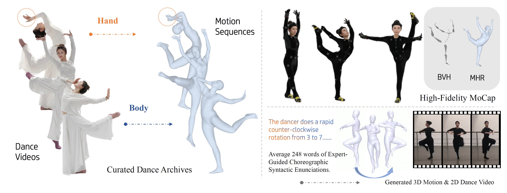

# DanceCrafter

## DanceCrafter: Fine-Grained Text-Driven Controllable Dance Generation via Choreographic Syntax

Hang Yuan, Xiaolin Hu, Yan Wan, Menglin Gao, Wenzhe Yu, Cong Huang, Fei Xu, Qing Li, Christina Dan Wang, Zhou Yu, Kai Chen

[Paper](https://arxiv.org/abs/2604.18648) | [Project Page](https://faustrazor.github.io/)

## Overview

DanceCrafter is a fine-grained text-driven controllable dance generation framework built on a novel **Choreographic Syntax** representation. We introduce **DanceFlow**, a high-quality dance dataset that combines curated dance video archives, expert motion capture data, and detailed choreographic descriptions for precise control of complex dance sequences.

Our goal is to enable controllable synthesis of:

- 3D dance motion
- expressive 2D dance video
- fine-grained choreography aligned with detailed textual descriptions

## Code

Coming soon.
